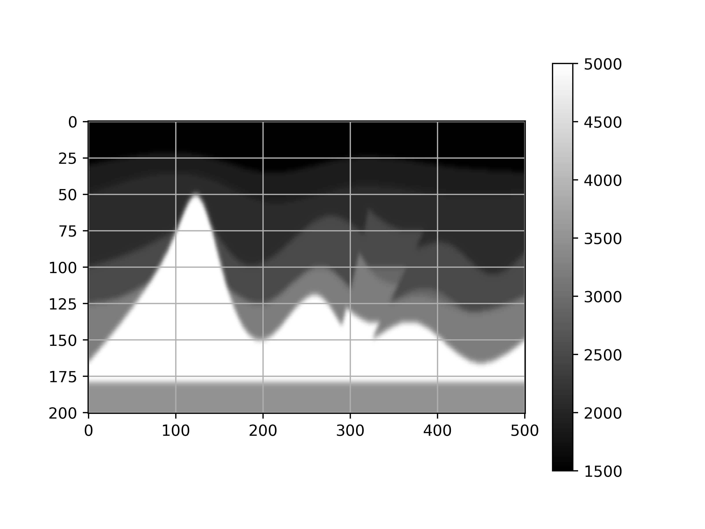

# Imaging2D_WLSQ
## Imaging with 2D wavefields using Weighted Least SQuares (WLSQ) extrapolation.

### Implementation Decisions

The code was developed initially in Python programming language and all computationaly expensive parts are
implemented in C++ and CUDA-C++ to allow better optimizations. You can run this software both in a CPU or an
NVIDIA GPU. The code is still under development for optimization purpose however it is alreafy fully functional 
and tested to produce correct results. The code is oriented to run in Linux operating systems, locally or in remote
servers.

Python works as the glue code that utilizes useful libraries such as *numpy*, *scipy*, *skimage*, *unittest* etc.
that favor developement productivity and at the same provide sufficient perfromance. For even higher performane we
use the module *ctypes* to interface with C++ or CUDA-C++ compiled code. We suggest to install Python using the Anaconda
framework.

- Python : [https://docs.anaconda.com/anaconda/install/linux/](https://docs.anaconda.com/anaconda/install/linux/)

To be able to compile the code you need to have installed 
Intel's Math Kernel Library (MKL) and CUDA, both are available for free download.

- MKL : [https://software.intel.com/en-us/mkl/choose-download](https://software.intel.com/en-us/mkl/choose-download)
- CUDA : [https://developer.nvidia.com/cuda-downloads](https://developer.nvidia.com/cuda-downloads)

### How to run the code

To run this code you need first to compile the C++ source code which is present in the directory ***/cpp_src/*** using 
the Makefile in the same directory. To do so open the Makefile and specify the location of intel mkl directory.

In example:

INTEL = /opt/intel

MKLROOT = $(INTEL)/mkl

When you manage to compile succesfully you should see the following dynamic shared libraries in the same directory.

- *extrapolation_cpu.so*
- *extrapolation_gpu.so*
- *extrapolation_revOp_gpu.so*

The first library provides implementation of extrapolation and imaging on CPU, while the second and third do so for GPU.
The third libray is the latest one and generally performs faster. We suggest to use this (*in case you want to run on a GPU*)!

The selection is done at run-time in the python script **main.py** according to the user's choice, which is provided
as command line parameter.

In example, in order to utilize the CPU implementation (*extrapolation_cpu.so*), the command is:

- python main.py demo-data/velmod.csv demo-data/problemSetup.txt demo-data/seismicShots/ demo-result host

*note the last parameter "host"*

In order to use the second library (naive GPU implementation), replace the 5th parameter "host" with "device". 
To use the third replace "host" with "device_revOp", like this:

-  python main.py demo-data/velmod.csv demo-data/problemSetup.txt demo-data/seismicShots/ demo-result **device_revOp**

#### Command line parameters

The main python script (**main.py**) needs the following 5 command line parameters:

- a comma separated values (CSV) file with the 2D velocity model (*see demo-data/velmod.csv*)
- a simple txt file with the problem configuration parameters, i.e nz, nx, nf etc. (*see demo-data/problemSetup.txt*)
- a directory containg (CSV) files where each file contains the signal recorded at the "surface" of the model
you wish to image. Each file name **must** follow the syntax ***seisX_NX.csv***, where **X** is the position (in x-axis)
of the source and **NX** the range. (*see the files in the directory demo-data/seismicShots*).
- the output directory (*i.e demo-results*)
- one of the three options: *host*, *device* or *device_revOp* that indicates where you want the extrapolation and imaging
to be computed (CPU, GPU version 1, GPU version 2).

Upon completition the code saves in the specified output directory (parameter 4) the velocity model and accumulated (over all shots)
final image as CSV files. You can visualize each with the provided script **vis.py**.

#### Some results

